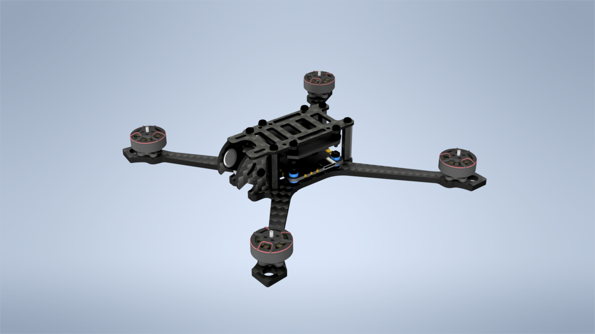

# Recursion Scythe (Clone)

3.5" ultralight FPV drone frame  
Originally designed by RecursionLabs

Please consider buying the original frame here: https://www.cncdrones.com/scythe.html  
Please don't use my files unless you are unable to get the original frame (e.g., due to regional restrictions) or already own it.

DXF folder contains classic plates for 20x20 stack, as well as modified plates that support both 20x20 and 25x25 stacks